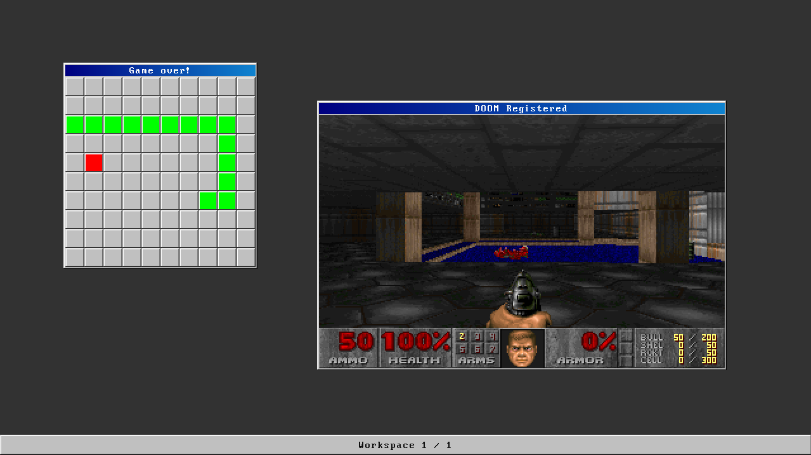

# MinOS
The third rewrite of MinOS



# Ports
* Musl 1.2.3
* Lua 5.4.4
* [Doom :-)](https://github.com/ozkl/doomgeneric)
* [Scalable Screen Font 2.0](https://gitlab.com/bztsrc/scalable-font2/)

# Toolchain and userspace
MinOS uses Musl as its standard library, and uses Clang to build it.
For userspace, a GCC cross-compiler is used (i686-minos-gcc).

## Dependencies
On Fedora:
* clang
* gcc
* g++
* lld
* nasm
* binutils
* cmake
* xorriso
* grub2-pc
* grub2-tools-extra
* clang-tools-extra
* texinfo
* wget

## Building
The full toolchain can be built like so:
```
./scripts/build_musl.sh &&\
./scripts/build_toolchain.sh
```
Then build the project:
```
# (after adding toolchain/prefix/bin to path)
mkdir build
cd build
cmake -DCMAKE_TOOLCHAIN_FILE=../toolchain/CMake/toolchain.cmake .. -G Ninja
ninja
```

## Musl changes
* src/thread/i386/__set_thread_area.s has been commented out, and a stub provided in __init_tls.c instead (which avoids manipulating segment registers)
* arch/i386/pthred_arch.h has been stubbed out (for the same reason as above)
* crt/crt1.c supports the change above with a false pthread
* this all means that TLS is not supported yet

## Running with Qemu
`qemu-system-i386 -cdrom build/MinOS.iso -serial mon:stdio`

## Attributions
* Uses the [Perfect DOS VGA 437](https://www.dafont.com/perfect-dos-vga-437.font) font
* Toolchain built with patches from [Nightingale](https://github.com/tyler569/nightingale) and [SerenityOS](https://github.com/SerenityOS/serenity)

## History
* MinOS 1 - mostly written in the summer of 2021, C and C++
* MinOS 2 - written a few months ago (mid 2022), in Rust
* MinOS 3 - written now (from August 2022), back in C and C++
